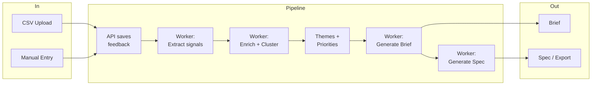

# How the system is built (plain English)

This document explains the **architecture** of Cursor for PMs: what pieces exist, what they do, and how they talk to each other. No jargon—readable by anyone.

---

## The big picture

The app has five main parts:

1. **Website (frontend)** — What you see and click in the browser.
2. **API (backend)** — The “brain” that handles login, data, and business rules.
3. **Background worker** — Does heavy work (AI extraction, clustering, generating briefs and specs) without slowing down the website.
4. **Database** — Stores users, feedback, themes, briefs, specs, and embeddings.
5. **AI service (Ollama)** — Runs the language model that reads feedback and writes structured text.

All of these run in **Docker containers** so you can start the whole stack with one command.

**System architecture (high-level):**

```mermaid
flowchart TB
    subgraph User
        Browser[Browser]
    end
    subgraph Docker["Docker Compose"]
        subgraph App
            Frontend[Website\nReact :3000]
            Backend[API\nFastAPI :8000]
            Worker[Background Worker\nCelery]
        end
        Redis[(Redis\nQueue)]
        DB[(PostgreSQL\n+ pgvector)]
        Ollama[Ollama\nAI Model :11434]
    end
    Browser -->|HTTPS / API calls| Frontend
    Frontend -->|REST + JWT| Backend
    Backend -->|Read/Write| DB
    Backend -->|Queue jobs| Redis
    Worker -->|Pick jobs| Redis
    Worker -->|Read/Write| DB
    Worker -->|LLM prompts| Ollama
    Backend -->|LLM prompts\nchat, etc.| Ollama
```

**Data flow (from feedback to spec):**

---

## What each part does

### Website (frontend)

- **Technology:** React, TypeScript, Vite, Tailwind CSS.
- **Runs on:** Port 3000 (http://localhost:3000).
- **What it does:** Login and signup, dashboard, upload CSV feedback, view feedback list, view themes and priorities, create and view briefs, create and view specs. It never talks to the database directly—only to the API.

### API (backend)

- **Technology:** FastAPI (Python).
- **Runs on:** Port 8000 (http://localhost:8000).
- **What it does:** Checks who you are (JWT), saves and loads data (feedback, customers, themes, briefs, specs), calls the worker to start long-running jobs (e.g. “run extraction on all failed feedback”), and for some actions calls the AI service itself (e.g. chat, or generating a section of a brief). All customer data is scoped by **organization** so one company never sees another’s data.

### Background worker

- **Technology:** Celery (Python), with Redis as the message queue.
- **What it does:** When you upload feedback, the API puts “extract this feedback” jobs into Redis. The worker picks them up, calls the AI to extract pain points and topics, saves the result, then may trigger enrichment or embedding. Same idea for clustering (group feedback into themes), generating briefs, and generating specs. So the website stays fast and the heavy work happens in the background.

### Database

- **Technology:** PostgreSQL 16 with the pgvector extension.
- **Runs on:** Port 5432 (inside Docker; the app connects to the `db` service).
- **What it stores:** Users, organizations, feedback items (with extracted fields and optional embeddings), customers, themes, priorities, briefs, specs, and supporting tables. **pgvector** is used to store embeddings so we can find “similar” feedback and cluster it.

### AI service (Ollama)

- **Technology:** Ollama running a model such as Llama 3 8B.
- **Runs on:** Port 11434 (inside Docker as the `ollama` service).
- **What it does:** The backend and worker send it prompts (e.g. “From this feedback, extract: pain point, topic, urgency, sentiment”) and get back structured text or JSON. We use it for extraction, naming themes, generating brief sections, and generating spec sections. No data is sent to the cloud if you use Ollama; everything stays on your machine or in your Docker network.

---

## How data flows

1. **You upload feedback** (CSV or manual) → API saves rows into the database and queues extraction jobs in Redis.
2. **Worker runs extraction** → For each feedback item, worker asks Ollama to extract signals, then saves them and may queue enrichment.
3. **You upload customers** (CSV) → API saves customers; worker can then match feedback to customers by email domain.
4. **You run clustering** → Worker computes embeddings (if missing), clusters feedback into themes, and saves themes.
5. **You create priorities and attach themes** → Stored in the database; used when generating briefs and when scoring.
6. **You generate a brief for a theme** → Worker (or API) asks Ollama to write each section using feedback and product context; result is saved as a brief.
7. **You generate a spec** → Worker asks Ollama to write each spec section (user stories, requirements, etc.); result is saved and can be exported as Markdown or Cursor-ready format.

So: **frontend → API → database** for reads/writes; **API → Redis → worker → Ollama** for long or AI-heavy tasks.

---

## What we use and why (simple)

| Need | What we use | Why (in one line) |
|------|-------------|-------------------|
| Web UI | React + TypeScript + Vite | Standard, fast, good for forms and dashboards. |
| Styling | Tailwind CSS | Quick to build consistent UI without writing lots of custom CSS. |
| API | FastAPI | Fast, clear, and easy to document; Python works well with ML and databases. |
| Database | PostgreSQL + pgvector | Relational data plus vector search for clustering. |
| Queue | Redis + Celery | Reliable background jobs; Redis is simple and fast. |
| Auth | JWT | No server-side sessions; frontend sends a token with each request. |
| AI | Ollama + Llama | Run the model locally; no API keys or cloud dependency for extraction. |
| Containers | Docker + Docker Compose | One command to run the whole stack the same way everywhere. |

---

## Security in one sentence

Every request that touches customer or feedback data is tied to an **organization**. The API always filters by the logged-in user’s org so one tenant never sees or changes another’s data.
