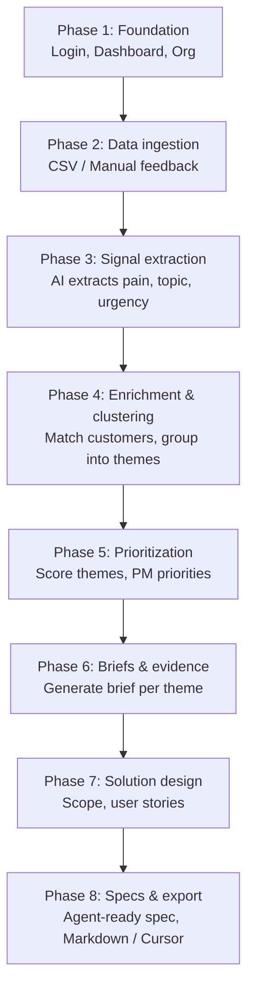
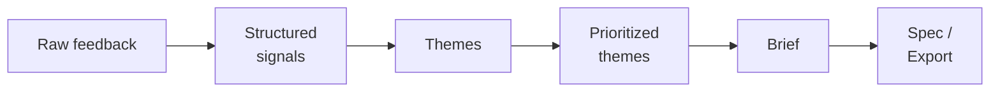

# Phases overview (plain English)

This document describes **what each phase of the project does**: the **plan** (what we set out to build) and the **architecture** (how it works and what we use). Written so a non-technical reader can understand.

---

## Pipeline overview (flow chart)

End-to-end flow from raw feedback to exportable spec:

**From feedback to spec (simplified):**

---

## Phase 1 — Foundation

**Plan:** Get a working app skeleton. Users can sign up, log in, and see a dashboard. No feedback or AI yet—just authentication, organizations, and the basic layout (sidebar, main area, chat placeholder). The app talks to a database and a cache; everything is ready for the next phases.

**Architecture:** We use a **React** frontend (what you see in the browser) and a **FastAPI** backend (the server that checks who you are and talks to the database). Users and organizations are stored in **PostgreSQL**. We use **JWT** so the frontend can prove “I am this user” on every request. **Docker Compose** runs the database, Redis, backend, and frontend so one command starts the whole stack.

---

## Phase 2 — Data ingestion

**Plan:** Let the product manager bring feedback into the app. They can upload a CSV file, or type a single feedback item by hand. Each piece of feedback is stored in one unified shape (who said it, what they said, when, where it came from). If the CSV is small, we process it immediately; if it’s large, we process it in the background and show progress.

**Architecture:** We add a **feedback_items** table and an **upload** API. The backend detects CSV columns (feedback text, email, name, company, date) and maps them into our schema. For big uploads, we use **Celery** and **Redis**: the API puts jobs in a queue, and a **worker** process runs them so the website doesn’t freeze. We track each upload as a **batch** so we know how many rows were processed or failed.

---

## Phase 3 — Signal extraction

**Plan:** Turn raw feedback text into structured “signals”: pain point, topic, urgency, sentiment, whether it’s about an existing feature or a new request, and a short verbatim quote. This is done by an AI model (e.g. Llama via Ollama) so the rest of the pipeline can work with clear fields instead of free text.

**Architecture:** After each feedback item is saved, we queue an **extraction** job. The worker calls the **LLM** (Ollama in Docker) with a prompt that says “extract these fields in JSON.” We validate the result and save it on the feedback item. If the model fails or returns bad data, we mark that item as failed so the PM can re-run extraction later. Product context (name, description, features, limitations) is sent to the model so it can interpret feedback in the right product context.

---

## Phase 4 — Enrichment and clustering

**Plan:**  
- **Enrichment:** Match feedback to customers. The PM uploads a customer list (e.g. domain, company name, segment). We match feedback to customers by email domain (and optionally by fuzzy matching with the AI). So we know “this feedback came from Acme Corp, enterprise segment.”  
- **Clustering:** Group similar feedback into **themes**. We turn each piece of feedback into a vector (embedding) and use a clustering algorithm to find groups. Each group becomes a theme (with a name and a list of feedback items). Some items stay “outliers” if they don’t fit any group.

**Architecture:** Enrichment uses the **customers** table and domain (or email domain) matching; we can use the LLM to guess “is this company the same as that one?” and save the mapping for next time. For clustering we use **sentence-transformers** (e.g. all-MiniLM-L6-v2) to get embeddings, store them in **pgvector**, and run **HDBSCAN** (or similar) to get clusters. The worker does this when the PM clicks “Run clustering”; results are stored in the **themes** table and feedback items are linked to themes.

---

## Phase 5 — Prioritization

**Plan:** Let the PM define **priorities** (e.g. “focus on enterprise,” “high urgency”) and attach them to themes. The system scores each theme (e.g. by volume, urgency, sentiment, segment fit) so the PM can see which themes matter most. The PM can tune weights so the score reflects their strategy.

**Architecture:** We have **priorities** (name, optional description) and **theme–priority** links. A **scoring** step (SQL plus optional LLM) computes a **priority score** per theme from feedback counts, urgency, sentiment, and segment. PM settings (weights) are stored and used in the formula. The dashboard and theme list show these scores so the PM can decide what to brief next.

---

## Phase 6 — Briefs and evidence

**Plan:** For a chosen theme, generate a **brief**: problem statement, customer impact, evidence summary, trend analysis, business case, recommended action, risks. Each section is written by the AI using the theme’s feedback and product context. We keep **evidence quotes** so every claim can be traced back to real feedback—no made-up data.

**Architecture:** A **brief** is a set of sections (title + content). The PM picks a theme and clicks “Generate brief.” The worker (or API) loads the theme’s feedback and product context, then calls the LLM once per section with a prompt that includes the feedback and “write only this section.” Results are stored; the PM can edit sections or regenerate. Evidence is stored in an **evidence_quotes** (or similar) structure so we can show “this sentence came from these feedback items.”

---

## Phase 7 — Solution design

**Plan:** From a brief (and optionally a theme), produce a **solution**: scope, user stories, flows, edge cases. This is still “what to build” at a product level, not yet the final engineer-facing spec. The PM can refine through conversation or edits.

**Architecture:** We store **solutions** (or equivalent) linked to a theme/brief. The LLM generates scope and user stories from the brief and feedback; we save them so Phase 8 can turn them into an agent-ready spec. Chat or edit flows let the PM adjust before moving to spec.

---

## Phase 8 — Specs and export

**Plan:** Turn a theme (and its brief/solution) into an **agent-ready spec**: clear sections (executive summary, user stories, functional requirements, technical guidance, data model, API contracts, testing). The spec can be exported as **Markdown** or in a **Cursor-friendly format** so an AI coding assistant (or a human) can implement it without guessing.

**Architecture:** We have a **specs** table (and sections) linked to a theme/brief. “Generate spec” triggers the worker to call the LLM for each section (or in one go), with prompts that reference the brief, product context, and any solution. We **do not** send format=json to Ollama for compatibility; we ask for JSON in the prompt and parse it from the raw response. Export endpoints return the full spec as Markdown or as a single document in the format Cursor expects. Chat tools can “generate spec” or “get spec section” so the PM can drive spec creation from the chat as well.

---

## How the phases fit together

- **Phase 1** gives you a running app and login.  
- **Phase 2** fills it with feedback.  
- **Phase 3** makes that feedback structured (extraction).  
- **Phase 4** attaches feedback to customers (enrichment) and groups it into themes (clustering).  
- **Phase 5** scores themes so you know what to work on first.  
- **Phase 6** turns a theme into a brief with evidence.  
- **Phase 7** turns a brief into a solution (scope and stories).  
- **Phase 8** turns that into a full, exportable spec for implementation.

Each phase builds on the previous one. The **architecture** (React, FastAPI, PostgreSQL, Redis, Celery, Ollama) is introduced in Phase 1 and 2, then reused and extended through Phases 3–8.
