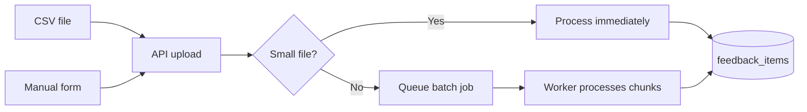

# Phase 2 — Data ingestion (plan and architecture)

Plain-English description of how feedback gets into the app.

---

## Flow chart

---

## Plan

**Goal:** Let the product manager bring customer feedback into the app in a simple way.

We wanted:

- **CSV upload:** The PM uploads a spreadsheet of feedback. The app figures out which column is the feedback text, which is email, name, company, date (if present), and saves each row as one feedback item.
- **Manual entry:** The PM can type one feedback item at a time (with optional name, email, company).
- **Unified shape:** No matter where feedback comes from, we store it in one format: content, who said it, when, and where it came from (CSV, manual, or later Slack).
- **Large files:** If the CSV is small, we process it right away. If it’s big, we process it in the background and show progress so the website doesn’t freeze.

---

## Architecture (how it works)

**Database:**

- A **feedback_items** table: one row per piece of feedback. Fields include content, author email/name, organization name, timestamp, source type (e.g. csv, manual), and a source id (e.g. batch and row number for CSV).
- A **batches** table: one row per CSV upload so we know filename, how many rows, how many succeeded or failed, and status (pending, completed, failed).

**Backend (API):**

- **Upload CSV:** The API receives the file, reads the header row, and uses a fixed set of column names (feedback, message, text, email, name, company, date, etc.) to map columns. It then either inserts rows directly (sync) or writes the file to disk and queues a **Celery** task (async).
- **Manual feedback:** One endpoint that accepts content plus optional name, email, company; creates one feedback item and queues an extraction job for later.

**Worker (background):**

- **Celery** with **Redis** as the queue. When the API queues “process this CSV batch,” the worker reads the file in chunks, maps each row to our schema, and inserts into **feedback_items**. It updates the batch’s progress and, when done, marks the batch complete. For each new feedback item we can queue an extraction job (Phase 3).

**Why this design:**

- Sync for small CSVs keeps the flow simple; async for large ones keeps the site responsive. The worker does the heavy lifting so the API stays fast.
