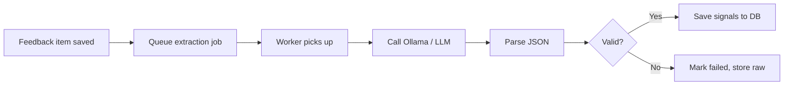

# Phase 3 — Signal extraction (plan and architecture)

Plain-English description of how we turn raw feedback into structured signals.

---

## Flow chart

---

## Plan

**Goal:** Turn each piece of feedback text into clear, structured “signals” so the rest of the app can work with facts instead of free text.

We wanted:

- For every feedback item, the system extracts: **pain point**, **topic**, **urgency**, **sentiment**, whether it’s about an **existing feature** or a **new request**, a **verbatim quote**, and a **confidence** score.
- This to happen **automatically** after feedback is ingested (in the background).
- The PM to see which items were extracted successfully and which failed, and to **re-run extraction** for failed or pending items.

---

## Architecture (how it works)

**Where it runs:**

- A **Celery task** runs per feedback item. The API (or CSV ingestion) queues “extract signals for this item.” The **worker** picks it up, calls the AI, then saves the result.

**AI (LLM):**

- We use **Ollama** (e.g. Llama 3 8B) running in Docker. We send a **prompt** that includes the feedback text and (if available) **product context** (product name, description, features, limitations). The prompt asks the model to respond with a **single JSON object** with the required fields. We do **not** use Ollama’s “format: json” option (it can cause 500 errors); we ask for JSON in the prompt and parse the response (and strip markdown code fences if present).

**Validation:**

- We check that the model returned valid values: e.g. urgency one of low/medium/high/critical, sentiment one of positive/neutral/negative, confidence between 0 and 1. If anything is wrong, we mark the item as **failed** and store the raw response so we can debug. The PM can click “Re-run extraction” to try again.

**Database:**

- The **feedback_items** table gets new columns: pain_point, topic, related_feature, is_existing_feature, feature_gap, urgency, sentiment, verbatim_quote, extraction_confidence, extraction_status, raw_llm_response, extracted_at.

**Product context:**

- If the PM has set product context (name, description, features, limitations), we load it and pass it into the extraction prompt so the model can interpret feedback in the right product context.
