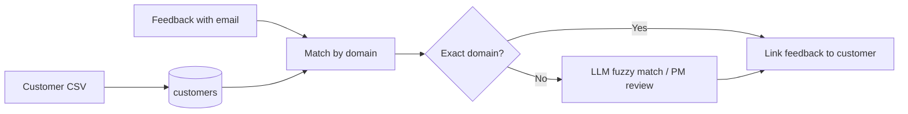
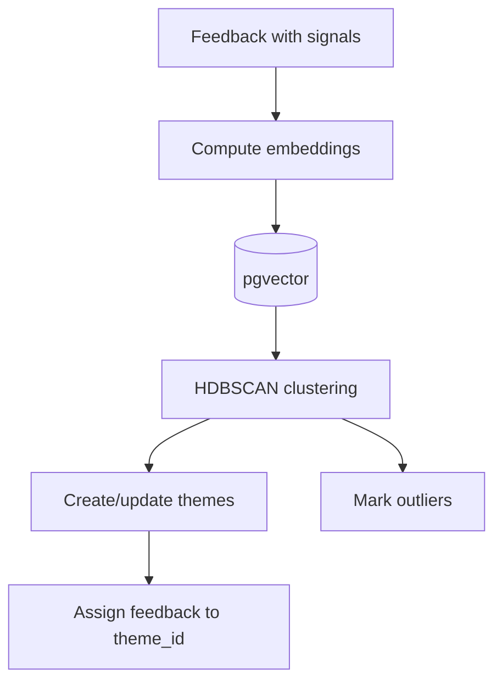

# Phase 4 — Enrichment and clustering (plan and architecture)

Plain-English description of how we match feedback to customers and group it into themes.

---

## Flow charts

**Enrichment (match feedback to customers):**

**Clustering (group into themes):**

---

## Plan

**Goal:**  
1) **Enrichment:** Know which customer each piece of feedback came from. The PM uploads a customer list (e.g. domain, company name, segment). We match feedback to customers (e.g. by email domain) so we can say “this feedback is from Acme Corp, enterprise.”  
2) **Clustering:** Group similar feedback into **themes**. So instead of 100 separate comments, the PM sees “Theme: Public roadmap” with 12 items, “Theme: Jira integration” with 8, etc. Some items may stay as “outliers” if they don’t fit any group.

---

## Architecture (how it works)

**Enrichment:**

- **Customers** table: domain, company name, segment (and optional extra fields). The PM uploads a CSV; we detect columns (domain, company_name, segment) and upsert by domain.
- **Matching:** For each feedback item we look at the author’s email domain. We try: exact domain match in customers, then saved mappings (e.g. “acme-corp.com = Acme Inc”), then optionally the LLM (“is Acme Corporation the same as Acme Inc?”). When we find a match we store customer_id (and segment, etc.) on the feedback item. A **worker task** can run enrichment per item after extraction; we also support “re-enrich unmatched” after a new customer upload.

**Clustering:**

- **Embeddings:** We turn each feedback item’s text (e.g. pain_point or content) into a vector using an **embedding model** (e.g. sentence-transformers, all-MiniLM-L6-v2). Vectors are stored in the database using **pgvector**.
- **Clustering:** We run a clustering algorithm (e.g. **HDBSCAN**) on the embeddings so that similar feedback ends up in the same cluster. Each cluster becomes a **theme** (with a generated or PM-edited name). Feedback items get a theme_id; some are marked as **outliers** (no theme).
- **When it runs:** The PM clicks “Run clustering” (or similar). The worker loads feedback that has embeddings, runs the algorithm, creates or updates themes, and assigns feedback to themes. Results are stored so the PM can see themes and their feedback counts.

**Why embeddings + HDBSCAN:**

- Embeddings capture meaning (semantic similarity). HDBSCAN finds groups without us having to say “how many themes”; it can also leave some points as outliers, which fits real feedback where not everything clusters.
