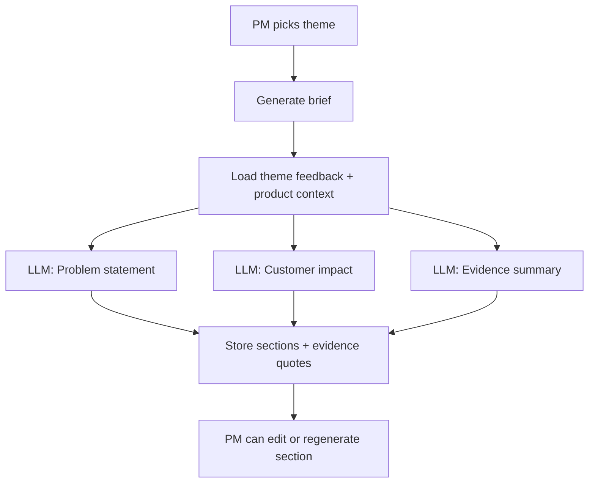

# Phase 6 — Briefs and evidence (plan and architecture)

Plain-English description of how we generate evidence-backed briefs for a theme.

---

## Flow chart

---

## Plan

**Goal:** For a chosen theme, produce a **brief** that a human or an AI can use to understand the problem and the case for acting on it.

We wanted:

- **Sections:** Problem statement, customer impact, evidence summary, trend analysis, business case, recommended action, risks.
- Each section **written by the AI** using the theme’s feedback and product context—no copy-paste from the PM.
- **Evidence:** Every claim traceable to real feedback. We store quotes and links back to feedback items so we never invent data.
- The PM to **edit** any section or **regenerate** it, and to **export** the brief (e.g. as Markdown).

---

## Architecture (how it works)

**Data model:**

- **Briefs** (or equivalent) linked to a theme. Each brief has **sections**: key (e.g. problem_statement), title, content, generated_at, edited flag, optional edit_history.
- **Evidence quotes** (or embedded in brief): links from a sentence or claim to specific feedback items (and verbatim quotes). So “customers want a public roadmap” is backed by “Quote from feedback item X: ‘We need to see what you’re building.’”.

**Generation:**

- The PM picks a theme and clicks “Generate brief.” The backend or worker loads the theme’s feedback (and product context), then for **each section** calls the **LLM** with a prompt that includes the feedback and “write only this section.” We append evidence (quotes and feedback ids) so the brief is grounded. Results are saved as section content; the PM can regenerate one section or edit by hand.

**No hallucination:**

- The prompts instruct the model to use only the provided feedback and product context. We don’t ask it to invent examples; we pull real quotes from the feedback items and attach them to the brief.

**Export:**

- An endpoint (or UI action) returns the full brief as one document (e.g. Markdown) so the PM can share or paste into other tools.
