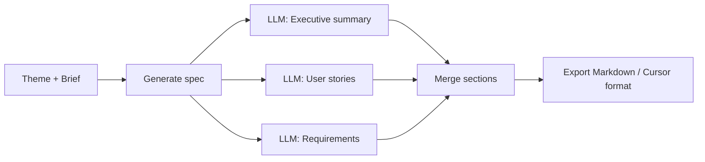

# Phase 8 — Specs and export (plan and architecture)

Plain-English description of how we produce agent-ready specs and export them.

---

## Flow chart

---

## Plan

**Goal:** Turn a theme (and its brief and solution) into an **agent-ready spec**: a structured document that an AI coding assistant (e.g. Cursor) or a human engineer can use to implement the feature without guessing.

We wanted:

- **Sections:** Executive summary, background and evidence, user stories, functional requirements, technical guidance, data model changes, API contracts, testing and verification.
- Each section **generated by the AI** from the brief, solution, and product context.
- The PM to **edit** or **regenerate** any section.
- **Export** as **Markdown** or in a **Cursor-friendly format** (one document with clear structure) so it can be dropped into Cursor or another tool.

---

## Architecture (how it works)

**Data model:**

- **Specs** table linked to a theme (and optionally brief). Each spec has **sections**: key (e.g. executive_summary), title, content (markdown), generated_at, edited, edit_history. We store the full list of section keys and their content so we can rebuild the document for export.

**Generation:**

- “Generate spec” triggers the **worker** (or API) to load the theme’s brief, solution, and product context. For **each section** we call the **LLM** with a prompt that includes the relevant prior sections and “output only this section’s content.” We do **not** use Ollama’s format=json for compatibility; we ask for structured content in the prompt and parse or use raw markdown. Results are saved; failed sections get a placeholder so the PM can regenerate.

**Export:**

- **Markdown export:** We concatenate all sections (with titles) into one Markdown document and return it (or a download).
- **Cursor export:** We format the same content in the structure Cursor expects (e.g. Implementation Spec, Executive Summary, User Stories, etc.) so the PM can paste it into Cursor and start coding.

**Chat:**

- Chat tools can “generate spec” or “get spec section” so the PM can drive spec creation from the conversational UI as well as from the spec page.

**Why “agent-ready”:**

- The spec is explicit and structured (user stories, requirements, APIs, tests). An AI assistant can read it and generate code or tickets without having to infer intent from a long prose PRD.
